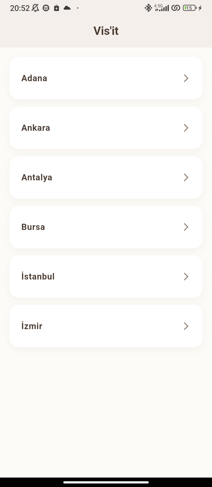

# 🌍 Vis'it — Şehir, Rota ve Mekan Keşif Mobil Uygulaması


**Vis'it**, gezginlerin Türkiye'deki şehirleri ve bu şehirlerdeki saklı mekanları keşfetmelerini, yeni rotalar oluşturmalarını ve seyahat deneyimlerini toplulukla paylaşmalarını sağlayan modern bir mobil uygulamadır.

---

## 📸 Uygulama Önizlemesi

Vis'it; sade, sıcak tonlara sahip (Espresso & Kemik Beyazı) modern kullanıcı arayüzü ile seyahatseverlere akıcı bir deneyim sunar.

<p align="center">
  
</p>

---

## ✨ Temel Özellikler

### 🏙️ 1. Şehir ve Lokasyon Keşfi
- Türkiye şehirlerini plaka kodu veya şehir adına göre anlık arama ve listeleme.
- Popüler şehir kartları ve öne çıkan gezi noktaları.

### 📍 2. Kategori Bazlı Mekan Filtreleme
- Tarihi yerler, doğal güzellikler, müzeler, kafeler ve kültürel rotalar.
- Görsel galeri desteği ve mekan hakkında detaylı açıklamalar.

### 🗺️ 3. Harita ve Navigasyon Entegrasyonu
- `url_launcher` altyapısı sayesinde tek dokunuşla cihazın yerel harita uygulamasında (`geo:` ve `https://maps.google.com`) rota başlatma.

### 💬 4. Topluluk Yorumları ve Puanlama
- Cloud Firestore ile gerçek zamanlı yorum akışı (`StreamBuilder`).
- 5 yıldız üzerinden puanlama ve kullanıcı geri bildirimleri.

### 🛡️ 5. Yerleşik İçerik Moderatörü (`ReviewModerator`)
- Kullanıcı yorumlarını analiz eden, hakaret ve uygunsuz ifadeleri gönderilmeden önce engelleyen kural motoru.

### 🧠 6. Mock Yapay Zeka Görsel Analiz Motoru (`AIImageAnalyzer`)
- Mekan önerisi yapılırken yüklenen fotoğrafların boyut, dosya yapısı ve içerik geçerliliğini denetleyen AI motoru simülasyonu.

### 👤 7. Gelişmiş Gezgin Dashboard'u
- **Eklediğim Noktalar:** Topluluğa önerilen tüm mekanların canlı listesi.
- **Değerlendirmelerim:** Yapılan tüm mekan yorumlarının geçmişi.
- **Gezilen Yerler:** Kullanıcının daha önce seyahat ettiği lokasyonları kaydettiği özel defter.
- **Gezilecek Hedefler:** Gelecekte ziyaret edilmek istenen noktalar için yapılacaklar (bucket list) listesi.

---

## 📁 Proje Dosya ve Dizin Mimarisi

Aşağıdaki tabloda projedeki kritik klasör ve dosyaların işlevleri özetlenmiştir:

| Dizin / Dosya | Açıklama |
| :--- | :--- |
| **`lib/main.dart`** | Uygulamanın tüm UI katmanını, Firestore sorgularını, moderasyon ve AI analiz sınıflarını barındıran çekirdek dosya. |
| **`android/`** | Android platformuna özel yerel yapılandırmalar (Gradle, AndroidManifest, izinler). |
| **`android/app/google-services.json.example`** | Firebase entegrasyonu için örnek yapılandırma şablonu (API key güvenliği için asıl dosya gizlenmiştir). |
| **`ios/`** | iOS platformuna özel yerel yapılandırmalar (Runner, Info.plist). |
| **`ios/Runner/GoogleService-Info.plist.example`** | iOS tarafı için örnek Firebase yapılandırma şablonu. |
| **`web/`** | Flutter Web desteği için temel HTML ve manifest dosyaları. |
| **`pubspec.yaml`** | Proje bağımlılıkları (`firebase_core`, `cloud_firestore`, `url_launcher`, `image_picker`). |
| **`.gitignore`** | API anahtarlarının, Firebase kimlik bilgilerinin ve derleme çıktılarının depoya sızmasını önleyen güvenlik kuralları. |

---

## 🚀 Kurulum ve Çalıştırma

Projeyi yerel ortamınızda çalıştırmak için aşağıdaki adımları takip edin:

### 1. Gereksinimler
- [Flutter SDK](https://flutter.dev/docs/get-started/install) (v3.12+ önerilir)
- [Dart SDK](https://dart.dev/)
- Android Studio / VS Code ve bir Android Emulator / fiziksel cihaz

### 2. Projeyi Klonlayın
```bash
git clone https://github.com/ayberkkr/vis-it.git
cd vis-it
```

### 3. Bağımlılıkları Yükleyin
```bash
flutter pub get
```

### 4. Firebase Yapılandırması (Önemli 🔒)

Projede canlı veritabanı (Cloud Firestore) kullanıldığı için kendi Firebase projenizi bağlamanız gerekmektedir:

1. [Firebase Console](https://console.firebase.google.com/) üzerinden yeni bir proje oluşturun.
2. Android uygulaması ekleyin (Paket adı: `com.example.visit`).
3. İndirdiğiniz `google-services.json` dosyasını `android/app/` dizinine yerleştirin:
   ```bash
   # Şablonu referans alarak kendi dosyanızı oluşturabilirsiniz:
   cp android/app/google-services.json.example android/app/google-services.json
   ```
4. Firebase Console üzerinden **Cloud Firestore** veritabanını aktif edin. Aşağıdaki koleksiyon yapısını kullanabilirsiniz:
   - `cities` (Şehir dokümanları: `name`, `plate`, `places` [alt liste])
   - `users` (Kullanıcı profilleri ve `visited_places` / `target_places` alt koleksiyonları)

### 5. Uygulamayı Başlatın
```bash
flutter run
```

---

## 🔒 Güvenlik ve Gizlilik Politikası

Bu depo açık kaynak ve paylaşım standartlarına uygun olarak yapılandırılmıştır:
- Gerçek Firebase API anahtarları, proje kimlikleri (`google-services.json`, `GoogleService-Info.plist`) ve ortam değişkenleri (`.env`) `.gitignore` ile korunmaktadır.
- Projeyi çatallayan (fork eden) geliştiriciler `.example` şablonlarını kullanarak kendi güvenli Firebase ortamlarını tanımlayabilir.

---

## 👨‍💻 Geliştirici

- **Ayberk Kar** ([@ayberkkr](https://github.com/ayberkkr))
